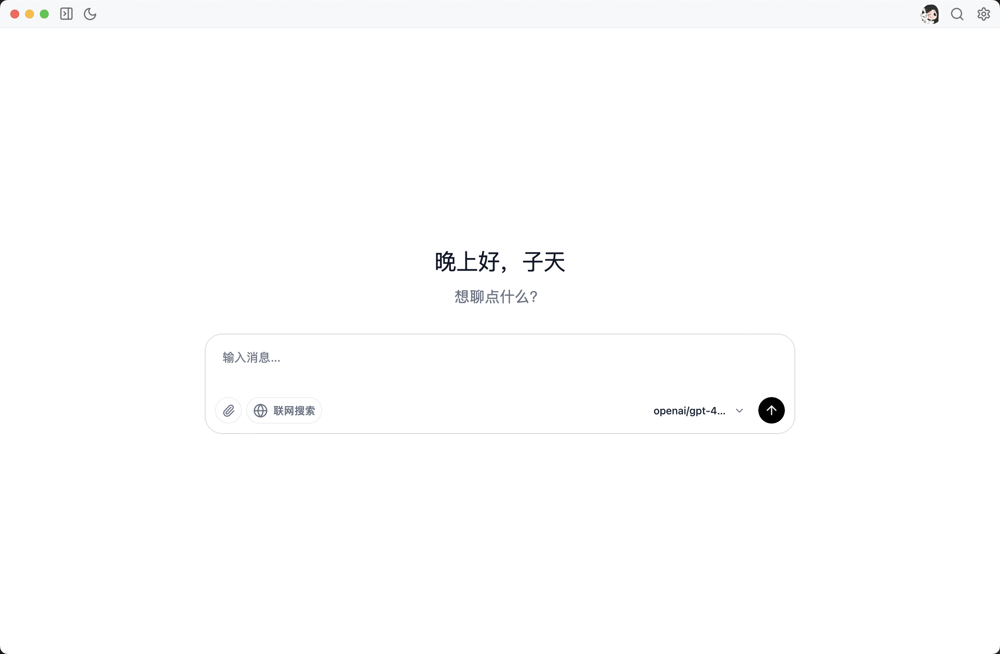
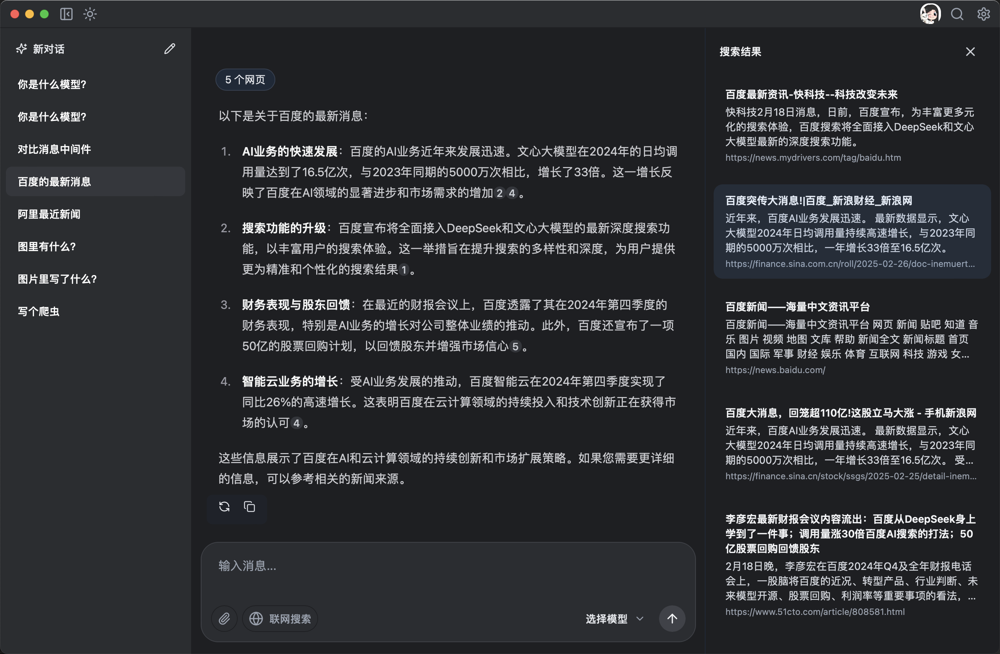
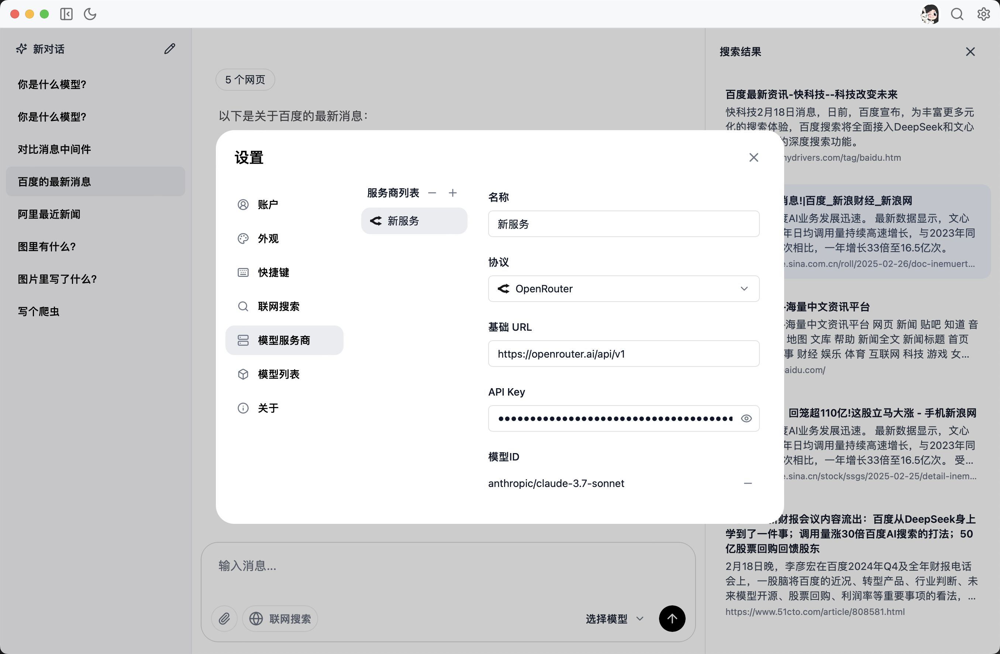

# Yogu 聊天桌面应用

<p align="center">
  
</p>

## 项目简介

Yogu 是一款基于 Tauri 和 Vue 3 构建的现代化 AI 聊天桌面应用程序。它支持多种 AI 模型提供商，包括 Anthropic、OpenAI、Google、Azure 等，并提供了丰富的功能和优雅的用户界面。

## 功能特点

- 🤖 支持多种 AI 模型提供商（Anthropic、OpenAI、Google、Azure、Deepseek 等）
- 🌐 内置网络搜索功能，增强 AI 回答的准确性
- 💬 聊天历史管理和组织
- 🔍 强大的搜索功能
- 🌙 明暗主题切换
- 🌍 多语言支持（中文、英文、日文）
- 📁 文件上传和处理
- ⌨️ 快捷键支持
- 🔄 自动更新功能

## 应用预览

<p align="center">
  
  <br>
  <br>
  
  <br>
  <em>聊天界面 - 支持多种AI模型</em>
</p>

<p align="center">
  
  <br>
  <em>暗色模式 - 保护您的眼睛</em>
</p>

<p align="center">
  
  <br>
  <em>设置界面 - 自定义您的体验</em>
</p>

## 技术栈

- **前端框架**：Vue 3 + TypeScript
- **状态管理**：Pinia
- **UI 样式**：Tailwind CSS
- **桌面应用框架**：Tauri 2.0
- **国际化**：Vue I18n
- **AI 集成**：AI SDK

## 安装指南

### 开发环境设置

1. 确保已安装 [Node.js](https://nodejs.org/) (推荐 v18+) 和 [Rust](https://www.rust-lang.org/tools/install)

2. 安装 pnpm

   ```bash
   npm install -g pnpm
   ```

3. 克隆仓库并安装依赖

   ```bash
   git clone https://github.com/yourusername/yogu-chat-app.git
   cd yogu-chat-app
   pnpm install
   ```

4. 启动开发服务器
   ```bash
   pnpm tauri dev
   ```

### 构建应用

```bash
pnpm tauri build
```

构建完成后，可执行文件将位于 `src-tauri/target/release` 目录。

## 使用指南

### 首次使用

1. 启动应用后，进入设置页面配置 AI 提供商的 API 密钥
2. 选择您喜欢的语言和主题
3. 开始新的聊天对话

### 快捷键

- `Ctrl/Cmd + K`：打开搜索对话框
- `Ctrl/Cmd + ,`：打开设置

## 贡献指南

欢迎提交 Pull Request 或创建 Issue 来帮助改进 Yogu 桌面应用。

## 许可证

本项目采用 [LICENSE](./LICENSE) 许可证。
